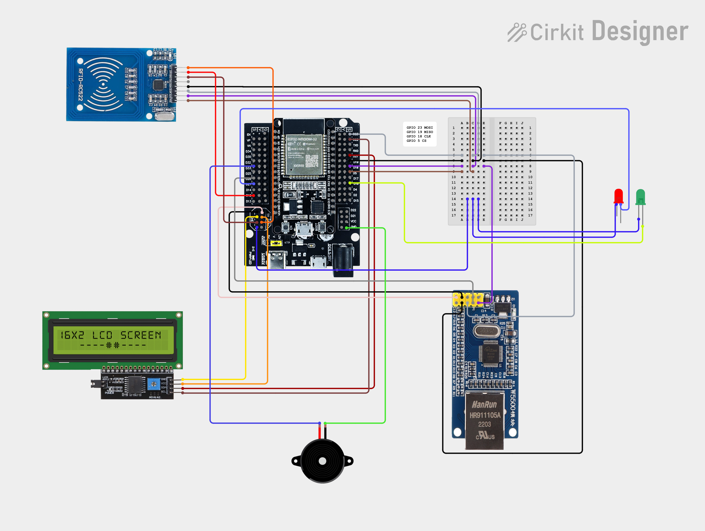

# IoT Absensi System

Sistem absensi berbasis RFID menggunakan ESP32 dengan koneksi LAN (W5500) dan WiFi sebagai backup. Sistem ini dapat secara otomatis berpindah antara koneksi LAN dan WiFi untuk memastikan keandalan sistem.

## Fitur

- ✅ Pembacaan kartu RFID (MFRC522)
- ✅ Dual Network: LAN (W5500) dan WiFi dengan auto-failover
- ✅ LCD 16x2 untuk display informasi
- ✅ LED indikator (Hijau/Merah) dan Buzzer
- ✅ Komunikasi dengan API server menggunakan HTTP POST
- ✅ Auto-reconnect ketika koneksi terputus

## Diagram Rangkaian

**[Buka di Circuit Designer Editor](https://app.cirkitdesigner.com/project/ef9e74c2-c2a1-4f43-9630-5cb392cd07a5)** untuk melihat dan mengedit diagram rangkaian.

## Komponen yang Dibutuhkan

1. *ESP32* (1 unit)
2. *ESP32 I/O Expansion* (1 unit)
3. *MFRC522 RFID Reader* (1 unit)
4. *W5500 Ethernet Module* (1 unit)
5. *LCD 16x2 dengan I2C Adapter* (1 unit)
6. *LED Hijau* (1 unit)
7. *LED Merah* (1 unit)
8. *Buzzer* (1 unit)
9. *Breadboard* (1 unit)
10. *Kabel Jumper (Male to Female dan Female to Female)* (Secukupnya)

## Koneksi Pin

### 1. MFRC522 RFID Reader
| MFRC522 Pin | ESP32 Pin | Keterangan |
|-------------|-----------|------------|
| VCC         | 3.3V      | Power      |
| GND         | GND       | Ground     |
| RST         | GPIO 2    | Reset      |
| SDA/SS      | GPIO 5    | Chip Select|
| SCK         | GPIO 18   | SPI Clock  |
| MOSI        | GPIO 23   | SPI MOSI   |
| MISO        | GPIO 19   | SPI MISO   |

### 2. W5500 Ethernet Module
| W5500 Pin   | ESP32 Pin | Keterangan |
|-------------|-----------|------------|
| VCC         | 3.3V      | Power      |
| GND         | GND       | Ground     |
| CS          | GPIO 26   | Chip Select|
| SCK         | GPIO 18   | SPI Clock (Shared)|
| MOSI        | GPIO 23   | SPI MOSI (Shared) |
| MISO        | GPIO 19   | SPI MISO (Shared) |

### 3. LCD 16x2 (I2C)
| LCD I2C Pin | ESP32 Pin | Keterangan |
|-------------|-----------|------------|
| VCC         | 5V        | Power      |
| GND         | GND       | Ground     |
| SDA         | GPIO 21   | I2C Data (Default)|
| SCL         | GPIO 22   | I2C Clock (Default)|

### 4. LED dan Buzzer
| Komponen    | ESP32 Pin | Keterangan |
|-------------|-----------|------------|
| LED Hijau   | GPIO 16   | Indikator Sukses |
| LED Merah   | GPIO 27   | Indikator Gagal  |
| Buzzer      | GPIO 33   | Audio Feedback   |

## Konfigurasi

### 1. WiFi Settings
Edit bagian berikut di file Absensi.ino:

cpp
const char* ssid     = "ssid";  // Ganti dengan SSID WiFi Anda
const char* password = "pw";     // Ganti dengan password WiFi Anda

### 2. API Server Settings
cpp
String apiHost = "192.168.x.xxx";          // IP Address server API
String apiPath = "/api/endpoint";            // Endpoint API
String apiToken = "YOUR_API_TOKEN_HERE";    // Token autentikasi

## Library yang Dibutuhkan

Install library berikut melalui Arduino IDE Library Manager:

1. *MFRC522* by GithubCommunity (v1.4.12)
2. *LiquidCrystal I2C* by Frank de Brabander (v1.1.2)
3. *Ethernet*
4. *ArduinoJson* by Benoit Blanchon (v7.4.2)
5. *WiFi* (Built-in ESP32)
6. *SPI* (Built-in)

## Cara Kerja Sistem

1. *Inisialisasi*
   - Sistem mencoba koneksi LAN terlebih dahulu
   - Jika LAN gagal, sistem otomatis beralih ke WiFi

2. *Monitoring Koneksi*
   - Sistem terus memonitor status koneksi LAN dan WiFi
   - Auto-failover jika koneksi utama terputus
   - Notifikasi di LCD saat perpindahan koneksi

3. *Proses Absensi*
   - Tempelkan kartu RFID ke reader
   - Sistem membaca UID kartu
   - Mengirim data ke server via LAN/WiFi
   - Server memvalidasi dan merespons
   - LED & buzzer memberikan feedback
   - Informasi ditampilkan di LCD

## Indikator Status

### LED Hijau
- Berkedip 1x dengan bunyi beep: Absensi berhasil

### LED Merah
- Berkedip 2x dengan bunyi beep: Absensi gagal / kartu tidak terdaftar

### LCD Display
- *Tempel Kartu*: Siap untuk scan
- *Memproses...*: Sedang mengirim data ke server
- *LAN Terhubung*: Koneksi LAN aktif
- *WiFi Terhubung*: Koneksi WiFi aktif
- *Pindah ke LAN/WiFi*: Perpindahan koneksi

*Last Updated:* December 2025